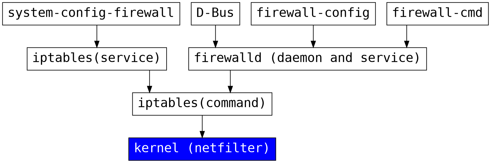

# Linux Firewall intro

[slide link](https://hackmd.io/@bULAV3m2SmimwHsIRJ8smg/S1W69vBYB)

---

### firewalld vs iptables


----

#### 相同性
- table
  - filter
  - nat
  - mangle
- chain

----

#### 相異性
- 在防火牆規則套用生效的部分， iptables 運作環境中，每當調整防火牆規則時 iptables 將會重新讀取所有防火牆規則並重新建立及套用 (套用生效的過程中，原有連線將會中斷)。
- firewalld 則不會重建所有防火牆規則 (僅套用差異的防火牆規則部分)，因此在套用新的防火牆規則時 firewalld 不會中斷現有已經允許且連線中相關的防火牆規則連線。
- zone (把 chain 的想法抽出來到 zone)

---

## firewalld
- Process order
- Direct interface
- Zone

----

### Process order

圖片來源：[鳥哥](http://linux.vbird.org/linux_server/0250simple_firewall.php)

----

#### cont.


----

#### Packet flow
```flow
st=>start: Start
recv_a=>end: Received
recv_d=>end: Dropped
accept_related=>condition: ACCEPT
input_direct=>condition: INPUT_direct
input_zones_source=>condition: INPUT_ZONES_SOURCE
input_zones=>condition: INPUT_ZONES
op1=>operation: direct rules
op2=>operation: INPUT_ZONES_SOURCE chain
op3=>operation: INPUT_zones chain
drop=>condition: DROP
reject=>operation: REJECT

st->accept_related
accept_related(yes)->recv_a
accept_related(no)->input_direct
input_direct(yes)->op1
input_direct(no)->input_zones_source
input_zones_source(yes)->op2
input_zones_source(no)->input_zones
input_zones(yes)->op3
input_zones(no)->drop
drop(yes, right)->recv_d
drop(no)->reject
```

----

#### Conclusion
1. direct interface
2. source zone
   - Decided by `--add-source`
3. interface zone
   - Decided by the zone of the interface
   - Routing table
4. default zone

---

### Direct interface
- Using method like iptables
- 可以用來加強防火牆的設定
  - prevent **ping-flood**, **port-scan**, **syn-flood**, etc.
  - [ダイレクトルールを使ったFirewallの強化](http://www.yam-web.net/centos7/direct-rule/index.html)

----

#### Direct interface Priorities
- Lower numbers have higher precedence.
- Rules with same priority, are not fixed and may change order.
- `/etc/firewalld/direct.xml`

----

#### Prevent syn-flood
```bash
firewall-cmd --permanent --direct --add-chain ipv4 filter syn-flood
firewall-cmd --permanent --direct --add-rule ipv4 filter INPUT 100 -p tcp --syn -j syn-flood
firewall-cmd --permanent --direct --add-rule ipv4 filter syn-flood 150 -m limit --limit 1/s --limit-burst 4 -j RETURN
firewall-cmd --permanent --direct --add-rule ipv4 filter syn-flood 151 -j LOG --log-prefix "IPTABLES SYN-FLOOD:"
firewall-cmd --permanent --direct --add-rule ipv4 filter syn-flood 152 -j DROP
```

----

#### Prevent ping-flood
```bash
firewall-cmd --permanent --direct --add-chain ipv4 filter ping-death
firewall-cmd --permanent --direct --add-rule ipv4 filter INPUT 300 -p icmp --icmp-type echo-request -j ping-death
firewall-cmd --permanent --direct --add-rule ipv4 filter ping-death 350 -m limit --limit 1/s --limit-burst 4 -j RETURN
firewall-cmd --permanent --direct --add-rule ipv4 filter ping-death 351 -j LOG --log-prefix "IPTABLES PING-DEATH:"
firewall-cmd --permanent --direct --add-rule ipv4 filter ping-death 352 -j DROP
```

---

### Zone


----

```
-j, --jump target
This specifies the target of the rule; i.e., what to do if the packet matches it. The target can be a user-defined chain (other than the one this rule is in), one of the special builtin targets which decide the fate of the packet immediately, or an extension (see EXTENSIONS below). If this option is omitted in a rule (and -g is not used), then matching the rule will have no effect on the packet's fate, but the counters on the rule will be incremented.
```
白話文：Jump 到下一個 chain 並 `RETURN` 後，會回到 Jump 時的 chain

----

```
-g, --goto chain
This specifies that the processing should continue in a user specified chain. Unlike the --jump option return will not continue processing in this chain but instead in the chain that called us via --jump.
```
白話文：Jump 到下一個 chain 並 `RETURN` 後，會回到 Jump **前一個** chain


----

#### Chain order
- ~~IN_public_pre~~(rich rules priority < 0)
- IN_public_log
- IN_public_deny
- IN_public_allow
- ~~IN_public_post~~(rich rules priority > 0)
Using priority to test `_post`, `_pre`, but show errors.

----

#### Rich Rule Priorities
- The syntax modifications add a new priority field. 
- This can be any number between -32768 and 32767.
- Lower numbers have higher precedence.
- Rules with same priority, are not fixed and may change order.

----

#### cont.
```flow
st=>start: Start
recv_d=>end: Dropped
in_public_log=>condition: IN_public_log
in_public_deny=>condition: IN_public_deny
in_public_allow=>condition: IN_public_allow
op1=>operation: IN_public_log chain
op2=>operation: IN_public_deny chain
op3=>operation: IN_public_allow chain
accept=>condition: ACCEPT
reject=>operation: REJECT

st->op1->op2->op3->accept
```

----

#### Rich Rule
```bash
firewall-cmd --add-rich-rule='rule family="ipv4" log prefix="test" source address="10.1.1.0/24" service name="ssh" accept'
```
- 根據後面的 action 將行為加到相對應的 chain 裡
  - accept：加到 IN_public_allow
  - reject：加到 IN_public_deny
  - drop：加到 IN_public_deny
  - mark：(待查)
  - 如有 log 會加到 IN_public_log

**在相同 chain 的情形，檔案裡寫入的會影響 firewalld 的行為。**

---

